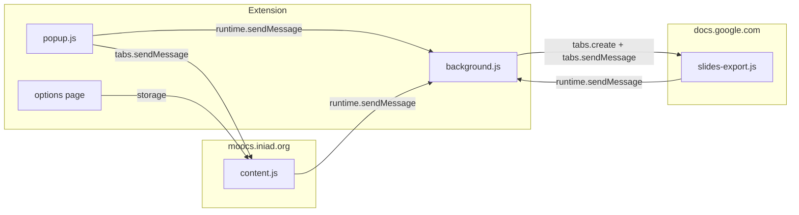
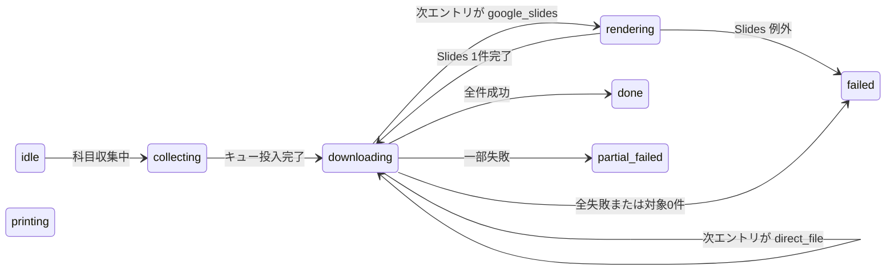

# AGENTS

このドキュメントは **AI エージェント・人間開発者の両方** が、このリポジトリで正しく実装・デバッグするための一次情報である。迷ったらコードより先にここを読み、不足があればコードと突き合わせて追記する。

---

## 1. プロジェクト概要

- **対象**: `https://moocs.iniad.org/*` 向けの **Manifest V3** ブラウザ拡張（Firefox / Chrome 双方を意識した `browser` / `chrome` 併用）。
- **ビルド成果物**: ブラウザ別に `dist/firefox/` と `dist/chromium/` を使い、各ディレクトリは `release` と `dev` のどちらか最後に実行した variant で上書きされる。
- **主目的**: MOOCs ページの UI 改変（グラスモーフィズム等）に加え、**授業資料の収集・階層付きダウンロード**（`Downloads/glassmoocs/年度/科目/講義グループ - 講義名/ファイル`）。
- **実行の核**: ページ改変は [`public/content.js`](public/content.js) の `MutationObserver` + `enhancePage()`。ダウンロード制御は [`public/background.js`](public/background.js)。Google Slides は [`public/slides-export.js`](public/slides-export.js) が `docs.google.com` 上で動作。
- **設定 UI**: [`src/options/`](src/options/)（Vite + React）。ビルド成果物が `options.html` 等として配布される。

**関連ドキュメント（役割分担）**

| ファイル                   | 用途                                                         |
| -------------------------- | ------------------------------------------------------------ |
| 本ファイル                 | 恒久的なアーキテクチャ・型・メッセージ・ルール               |
| [`HANDOFF.md`](HANDOFF.md) | 現在のブランチ・バグ状況・次に触るべき箇所のスナップショット |
| [`PLAN.md`](PLAN.md)       | フェーズ単位の Todo / Done                                   |

---

## 2. アーキテクチャ



- **content.js**: MOOCs DOM の解析、資料候補の抽出、ページ内ダウンロード UI、`download-assets` ペイロードの組み立て。
- **background.js**: `storage.local` のダウンロード状態、キュー処理、`downloads.download`、Slides 用タブの生成・`waitForTabLoad`・ジョブ待ち受け。
- **slides-export.js**: `docs.google.com` 上で Slides SVG を収集・画像をインライン化して、background に渡す。失敗時のみ表示タブキャプチャへフォールバックする。
- **popup.js**: アクティブ MOOCs タブへ **`tabs.sendMessage`**（`get-page-context` / `start-course-collection` / `download-current-lecture` / `download-current-page`）。状態取得・リセットは **`runtime.sendMessage`** で background へ。Slides 権限は popup または専用許可ウィンドウから `permissions.request`。

---

## 3. ファイルマップと主要関数

### [`public/manifest.json`](public/manifest.json)

- `permissions`: `storage`, `downloads`, `tabs`, `scripting`
- `host_permissions`: `https://moocs.iniad.org/*`
- `optional_host_permissions`: `<all_urls>`（Slides キャプチャ利用時に popup / 専用許可ウィンドウから付与）
- `content_scripts`: MOOCs + `https://docs.google.com/presentation/*`（後者のみ `slides-export.js`）

### [`public/content.js`](public/content.js)

| 領域                  | 代表関数                                                                                                                                                                                                             |
| --------------------- | -------------------------------------------------------------------------------------------------------------------------------------------------------------------------------------------------------------------- |
| 設定                  | `getDefaultSettings`, `mergeSettings`, `readSettings`                                                                                                                                                                |
| ページ装飾            | `enhancePage`, `scheduleEnhancements`, `decorateTabs`, `attachTextareaEnhancements`, `injectDownloadControls`                                                                                                        |
| URL / ページ文脈      | `parseMoocsUrl`, `getCurrentPageContext`, `extractCourseName`, `extractLectureName`                                                                                                                                  |
| 資料抽出              | `extractAssetCandidates`, `extractLectureEntries`, `extractPageEntries`, `isGoogleSlidesUrl`, `buildGoogleSlidesViewerUrl`, `deriveGoogleDriveDownloadUrl`                                                           |
| ダウンロード UI・状態 | `createDownloadPanel`, `injectDownloadControls`, `handleCourseCollectionRequest`, `handleLectureDownloadRequest`, `handleCurrentPageDownloadRequest`, `collectLectureAssetsFromCurrentPage`, `createCollectingState` |
| メッセージ            | `handleRuntimeMessage`                                                                                                                                                                                               |

補助ファイル:

- [`public/content/download-panel.js`](public/content/download-panel.js): ページ内ダウンロードパネルの UI コンポーネント

### [`public/background.js`](public/background.js)

| 領域             | 代表関数                                                                                                    |
| ---------------- | ----------------------------------------------------------------------------------------------------------- |
| ストレージラッパ | `storageGet`, `storageSet`, `loadState`, `saveState`                                                        |
| 状態復旧         | `recoverStaleState`, `recoverStateOnStartup`, `normalizeState`, `createIdleState`                           |
| キュー           | `queueDownloads`, `processDirectDownload`, `processSlidesDownload`                                          |
| Slides URL       | `buildSlidesViewerUrl`                                                                                      |
| Slides ジョブ    | `waitForTabLoad`, `sendTabMessageWithRetry`, `requestSlidesSessionInfo`, `requestSerializeCurrentSlideSvg`  |
| パス             | `buildDownloadFilename`, `buildLectureDirectory`, `sanitizePathSegment`, `normalizeEntry`, `summarizeEntry` |
| メッセージ       | `runtime.onMessage` リスナー（`MESSAGE_TYPES` 分岐）                                                        |

補助ファイル:

- [`public/background/pdf.js`](public/background/pdf.js): canvas / JPEG / PDF 組み立てユーティリティ

### [`public/slides-export.js`](public/slides-export.js)

- `waitForSlideReady`, `serializeCurrentSlideSvg`, `inlineSlideImages`, `getSlidesSessionInfo`
- グローバル二重起動防止: `globalThis.__glassmoocsExporterBooted`

補助ファイル:

- [`public/slides-export/svg-export.js`](public/slides-export/svg-export.js): SVG 直列化と画像インライン化

### [`public/popup.js`](public/popup.js) / [`public/popup.html`](public/popup.html)

- 進捗表示、科目単位 / 授業回単位 / ページ単位の収集トリガ、（あれば）Slides キャプチャ権限要求 UI

補助ファイル:

- [`public/popup/slides-permission-card.js`](public/popup/slides-permission-card.js): popup 内の Slides 権限カード制御

### [`public/slides-permission.js`](public/slides-permission.js) / [`public/slides-permission.html`](public/slides-permission.html)

- ページ内ダウンロード UI から開く **Slides キャプチャ権限専用ウィンドウ**

### [`src/options/`](src/options/)

- [`settings.js`](src/options/settings.js): `SETTINGS_STORAGE_KEY`, デフォルト設定、`mergeSettings` 等。content.js のデフォルトと **必ず整合**させる。

---

## 4. ストレージスキーマ

| キー                          | 定義場所              | 内容                                         |
| ----------------------------- | --------------------- | -------------------------------------------- |
| `glassmoocs_settings`         | content / settings.js | ユーザー設定オブジェクト                     |
| `glassmoocs_background_image` | content / settings.js | 背景画像 Data URL 等                         |
| `iniad_bg_image`              | レガシー              | 旧背景キー（移行用に読む場合あり）           |
| `glassmoocs_download_state`   | background / content  | **ダウンロード状態**（下記 `DownloadState`） |

**禁止**: 本番コードにローカルマシン固有の絶対パスを書かない。

---

## 5. データ型

### 5.1 `DownloadState`（`normalizeState` 後の形）

`background.js` の `createIdleState` / `normalizeState` に準拠する。

| フィールド                 | 型                  | 説明                                                                                                    |
| -------------------------- | ------------------- | ------------------------------------------------------------------------------------------------------- |
| `status`                   | string              | `idle` / `collecting` / `downloading` / `rendering` / `printing` / `done` / `partial_failed` / `failed` |
| `courseName`               | string              | 科目名                                                                                                  |
| `startedAt` / `finishedAt` | string (ISO)        | ジョブの開始・終了時刻                                                                                  |
| `activeItem`               | string              | UI 用。例: `講義名 / ファイル名`                                                                        |
| `activeJobType`            | string              | エントリの `kind` と同じ値が入ることが多い                                                              |
| `sourceUrl` / `viewerUrl`  | string              | Slides 時の追跡用                                                                                       |
| `stage`                    | string              | 例: `open-slides-viewer`, `fetch-slides-pdf`, `svg-export-fallback`, `collect-slide-x/y` 等             |
| `pending`                  | `SummarizedEntry[]` | キュー残り（要約形）                                                                                    |
| `completed`                | array               | 成功エントリ + `downloadId`, `storedFilename` 等                                                        |
| `failed`                   | array               | 失敗エントリ + `error`、復旧時は中断メタのみの場合あり                                                  |
| `lastError`                | string              | 直近エラーメッセージ                                                                                    |
| `needsCapturePermission`   | boolean             | capture fallback が権限不足で止まったとき `true`。popup / ページ内 UI の導線表示に使う                  |

### 5.2 `DownloadEntry`（キューに載る 1 資料）

`normalizeEntry` の出力に準拠。**`url` が空のエントリは `queueDownloads` で除外される。**

| フィールド     | 型     | 説明                                                               |
| -------------- | ------ | ------------------------------------------------------------------ |
| `id`           | string | 安定した一意 ID（`createAssetId`）                                 |
| `kind`         | string | **`direct_file`**（通常 URL）または **`google_slides`**            |
| `url`          | string | ダウンロードに使う URL。Slides では viewer 系                      |
| `sourceUrl`    | string | ページ上の元 `href` / `iframe.src` 等                              |
| `viewerUrl`    | string | Slides の埋め込み URL。background で `/pub` 等に変換される元になる |
| `filename`     | string | 拡張子付きファイル名（パスセグメントではない）                     |
| `year`         | string | 保存パス用。例 `2026`                                              |
| `lectureGroup` | string | 講義グループ名                                                     |
| `lectureName`  | string | 講義名                                                             |
| `pageTitle`    | string | ページタイトル由来のラベル                                         |
| `source`       | string | `anchor` / `iframe` / `embed` / `object` 等（抽出元）              |

`queueDownloads` 内では **Slides viewer URL / 通常 URL を正規化したキー**でデデュープ（先着優先）。

### 5.3 `SummarizedEntry`

`summarizeEntry(entry)` の結果。`pending` やログ用。`id`, `kind`, `url`, `sourceUrl`, `viewerUrl`, `filename`, `year`, `lectureGroup`, `lectureName`, `pageTitle`, `source`。

---

## 6. メッセージプロトコル（`runtime.sendMessage`）

型識別子は **文字列の完全一致**。定数は各ファイルの `MESSAGE_TYPES` を参照。

### 6.1 MOOCs `content.js` が処理する `type`

いずれも **`tabs.sendMessage(moocsTabId, message)`** で届く（popup がアクティブタブに送信）。

| type                                  | 送信元 | `message` 主フィールド | `sendResponse`                                                       |
| ------------------------------------- | ------ | ---------------------- | -------------------------------------------------------------------- |
| `glassmoocs:get-page-context`         | popup  | なし                   | `{ ok, context }` — `getCurrentPageContext(document, location.href)` |
| `glassmoocs:start-course-collection`  | popup  | なし                   | `{ ok, courseName, assetCount }` / `{ ok:false, error }`             |
| `glassmoocs:download-current-lecture` | popup  | なし                   | 同上                                                                 |
| `glassmoocs:download-current-page`    | popup  | なし                   | 同上                                                                 |

### 6.2 `background.js` が処理する `type`

**`runtime.sendMessage`** で届く（popup の状態取得・リセット、content の `set-download-state` / `download-assets` 等）。

| type                                               | 送信元           | 主フィールド                                             | `sendResponse` / 挙動                                                                      |
| -------------------------------------------------- | ---------------- | -------------------------------------------------------- | ------------------------------------------------------------------------------------------ |
| `glassmoocs:get-download-state`                    | popup / content  | なし                                                     | async `{ ok, state }`                                                                      |
| `glassmoocs:set-download-state`                    | content          | `state`                                                  | async `{ ok, state }`                                                                      |
| `glassmoocs:reset-download-state`                  | popup / content  | なし                                                     | async `{ ok, state }`（`queueNonce` インクリメント）                                       |
| `glassmoocs:download-assets`                       | content          | **`payload`**: `{ courseName, assets: DownloadEntry[] }` | 即時 `{ ok:true }` の後 **`queueDownloads` を非同期実行**（失敗時は state を `failed` に） |
| `glassmoocs:get-slides-capture-permission`         | popup / content  | なし                                                     | async `{ ok, granted }`                                                                    |
| `glassmoocs:open-slides-capture-permission-window` | content          | なし                                                     | async `{ ok, windowId }`                                                                   |
| `glassmoocs:fetch-image-data-url`                  | slides-export.js | `url`                                                    | async `{ ok, dataUrl }`。Slides タブ内 fetch が失敗した画像を background 経由で取得        |

### 6.3 `slides-export.js` が処理する `type`（`tabs.sendMessage` で届く）

| type                                     | 送信元     | 主フィールド               | `sendResponse`                                                                                         |
| ---------------------------------------- | ---------- | -------------------------- | ------------------------------------------------------------------------------------------------------ |
| `glassmoocs:get-slides-session-info`     | background | なし                       | `{ ok, totalPages, currentPage, title }`                                                               |
| `glassmoocs:wait-for-slide-ready`        | background | `page`, `previousSnapshot` | `{ ok, snapshot, captureMetrics, waitDurationMs }` または `{ ok:false, error }`                        |
| `glassmoocs:go-to-first-slide`           | background | なし                       | `{ ok:true }` / `{ ok:false, error }`                                                                  |
| `glassmoocs:go-to-slide`                 | background | `page`                     | `{ ok:true }` / `{ ok:false, error }`                                                                  |
| `glassmoocs:serialize-current-slide-svg` | background | `page`                     | `{ ok, svgText, renderWidth, renderHeight, viewBoxWidth, viewBoxHeight }` または `{ ok:false, error }` |

---

## 7. ダウンロード状態マシン（概念）



- **`queueDownloads`**: 開始時 `downloading`。各エントリ処理中は `google_slides` なら `rendering`、それ以外は `downloading`。ループ終了後、`failed.length` と `completed.length` で `done` / `partial_failed` / `failed` を決定。
- **`recoverStaleState`**: 拡張リロード時、`collecting` / `downloading` / `rendering` / `printing` を中断扱いに正規化。**過去の `failed` / `completed` は引き継がず**、`activeItem` があれば疑似 1 件を `failed` に入れるか、`idle` に戻す。

---

## 8. Google Slides 処理フロー（読む順）

1. **`permissions.contains({ origins: ['<all_urls>'] })`** — 未付与ならページ内 UI・popup・専用許可ウィンドウのいずれかから付与してもらう。
2. **`buildSlidesViewerUrl(entry)`**。`/embed`・`/pubembed` は **`/pub`**、private `/presentation/d/{id}/embed` は **`/present`** に寄せる（`waitForTabLoad` が `complete` になりにくい問題の対策）。
3. **`tabs.create({ url: viewerUrl })`** — `about:blank` のまま固まる場合は最大 5 回リトライ（2 秒間隔）。
4. まず Slides タブ上の SVG を順に直列化し、画像を data URL にインライン化して background へ返す。
5. background 側で SVG を JPEG 化して PDF を組み立てる。失敗時のみ `captureVisibleTab` フォールバックへ落とす。
6. **`finally` でタブを閉じる**。

---

## 9. 共通実装ルール

- **DOM 優先**: まずページ内の `a[href]` / `iframe[src]` 等から実 URL を得る。不要な権限・API を増やさない。
- **責務分離（content）**: 「対象検出」と「UI 注入」を分ける。
- **二重挿入防止**: 一度きりの UI には `data-glassmoocs-*` を付与。
- **遅延描画耐性**: `MutationObserver` + `enhancePage()` に乗せ、**再実行しても壊れない**こと。
- **設定を増やすとき**: [`public/content.js`](public/content.js) のデフォルトと [`src/options/settings.js`](src/options/settings.js) の **デフォルト値と merge の両方**を同じにする。
- **設定の最小化**: 本当に必要になるまで設定項目を増やさない。
- **ブラウザ API**: `const api = globalThis.browser || globalThis.chrome`。Promise / callback 両対応は既存ラッパに合わせる。

### 9.1 PR / コミット粒度

- 変更は**意味のある単位**で分ける。無関係な修正を 1 つの PR に混ぜない。
- 原則として **1 PR = 1 つの目的**（機能追加・不具合修正・リファクタ・ドキュメント更新のいずれか）に寄せる。
- **動作変更**と**整形・リネーム・ログ整理**はできるだけ別 PR / 別コミットにする。
- 大きい作業は、レビュー可能なサイズの **土台 PR → 本体 PR → cleanup PR** に分割してよい。
- ただし、分割しすぎて**単体では意味を持たない PR**は避ける。
- 未コミット差分をまとめて扱うときも、そのまま 1 つにせず、まず「何の変更か」で棚卸ししてから分割する。
- **1 回の依頼で着手した編集は、区切りがついた時点でこまめにコミットする。** 次の依頼に入る前に、少なくとも「戻せる場所」が `git` に残っている状態を原則とする。
- AI エージェントが編集する場合も同様に、**未コミット差分を溜めたまま別件へ移らない。** 例外が必要なら、その理由を `HANDOFF.md` か作業メモに明記する。

### 9.2 DO / DON'T（事故防止）

| DO                                                                               | DON'T                                                             |
| -------------------------------------------------------------------------------- | ----------------------------------------------------------------- |
| Slides を別タブで開く URL は **`buildSlidesViewerUrl` 経由の viewer** を使う     | `/embed` のまま「読み込み complete を待つ」だけに依存しない       |
| 大きな PDF は **background 側で逐次組み立てて Blob download**                    | 全ページ JPEG を配列に貯めてから別形式へ二重保持しない            |
| デバッグログは **JSON 一行＋仮説 ID**                                            | 本番に不要な `console.log` だけで終わらせない（必要なら後で削除） |
| ログ受け口は **`nc -l 7442` や `7443`、または POST を 200 応答で記録できるもの** | `python3 -m http.server 7442` だけを「取れる」と思わない          |

---

## 10. MOOCS 資料ダウンロード方針（製品観点）

- **第一候補**: ページ内に既にあるファイル URL をそのまま `downloads.download` 可能にする。
- **抽出元の例**: `a[href]`, `iframe[src]`, `embed[src]`, `object[data]`
- **UI**: 資料表示付近。ホーム画面ではダウンロード UI を出さない方針（既存実装に合わせる）。
- **候補が 1 件**: 単一ボタン。**複数**: 一覧または複数ボタン。
- **抽出ロジック**: **純関数に切り出し**、fixture / 保存 HTML があればそれで検証（リポジトリ外パスはコードに書かない）。

---

## 11. 参考データ

- 元メモでは `downroad/moocs` を想定していたが、**リポジトリ内に無い場合がある**。実装前にパスを確認するか、匿名化した HTML を repo に置く運用を検討。

---

## 12. 実装・検証の推奨順序

1. 資料ページの DOM パターンを特定する。
2. URL 抽出関数を作る（既存は `extractAssetCandidates`）。
3. `enhancePage()` から呼ぶ UI を差し込む。
4. 必要なら設定 ON/OFF（content + settings.js）。
5. **`corepack pnpm run ci`**（`eslint` + `prettier --check` + `pnpm run build:release`）。

---

## 13. デバッグの極意

この拡張は **background → content → サードパーティ（Google）** の非同期が直列化されており、`console.log` だけでは追えない。

### 13.1 構造化ログ（JSON）

バックグラウンド・コンテンツ・（必要なら）`slides-export.js` で共通フォーマットを使う。**通常は OFF にし、Options の「構造化デバッグログを有効にする」または URL の `glassmoocs_debug_log=1` で必要時だけ有効化する。**

```js
fetch('http://127.0.0.1:7443/ingest/<セッションID>', {
  method: 'POST',
  headers: { 'Content-Type': 'application/json' },
  body: JSON.stringify({
    sessionId: '<セッションID>',
    location: 'background.js:processSlidesDownload',
    message: '処理の意図を一言で',
    data: { tabId, url, status },
    hypothesisId: 'H-A',
    timestamp: Date.now(),
  }),
}).catch(() => {});
```

- `sessionId` はセッション開始時に固定し全ログに付与する。
- **`.catch(() => {})` 必須**（サーバ未起動で握りつぶす）。
- `runtime` は `content` / `background` / `slides-export` を入れる。
- 大きな本文（SVG 全文、data URL、HTML 全体）は送らず、**件数・長さ・URL・hash・要約**に留める。

### 13.2 ログを置く場所

| 場所                | 記録内容                             |
| ------------------- | ------------------------------------ |
| 非同期関数の入口    | 引数・呼び出し元識別子               |
| `await` 直前 / 直後 | 投入値・返却値・例外                 |
| 条件分岐            | どの branch か + 判定に使った変数    |
| `catch`             | `error.message`, `error.name`, stack |
| タブ作成・削除      | `tabId`, URL, 理由                   |
| `browser.storage`   | key、値は大きければ型と長さ          |

### 13.3 仮説 ID

```js
// [H-A] optional_permissions 未付与でナビゲーションがブロックされている
// [H-B] tabs.create 直後は url が未確定の about:blank
```

ログの `hypothesisId` と一致させる。**棄却した仮説はコードとコメントを整理して削除する。**

### 13.4 LLM にログを渡すフォーマット

```
--- ログ開始 ---
{...JSON...}
--- ログ終了 ---
上記ログを読んで、[H-A][H-B] のどちらが支持されるか判断してください。
```

**30〜50 行以内**を目安に。`jq` / `grep hypothesisId` で絞る。

### 13.5 ログ削除のタイミング

「修正後のログで成功が確認できるまで消さない」

- 成功ログが得られた
- かつ再現手順を **2 回**繰り返し **2 回とも成功**

この後、`#region agent log` ごと削除してよい。

### 13.6 Firefox でのログの見方

| スクリプト       | 見る場所                                            |
| ---------------- | --------------------------------------------------- |
| background       | `about:debugging` → 拡張 → **調査**                 |
| content（MOOCs） | 該当 MOOCs タブの DevTools                          |
| slides-export    | **`docs.google.com` を表示しているタブ**の DevTools |

拡張リロードで background のコンソールはリセットされる。**リロード前後でログを分けて記録する。**

### 13.7 再現手順テンプレート

手順なしで「直った」「壊れた」と書いても次の担当者は追えない。

```
再現手順:
1. …
2. …

期待:
- 完了件数 / 失敗件数
- 保存先パス例: glassmoocs/2026/科目名/…

実際:
（実行後に記録）
```

---

## 14. 既知の注意点・バグの種（スナップショット）

詳細は [`HANDOFF.md`](HANDOFF.md) を見よ。ここでは **エージェントがハマりやすい論点**だけ列挙する。

| 論点                   | 内容                                                                                                                                                 |
| ---------------------- | ---------------------------------------------------------------------------------------------------------------------------------------------------- |
| **`about:blank` タブ** | `processSlidesDownload` で `waitForTabLoad` 後も URL が `about:blank` のままになることがある。権限・URL 組み立て・タイミングの仮説でログを取ること。 |
| **Slides URL**         | `buildSlidesViewerUrl` が **embed → pub / present** 変換の要。ここを迂回するとタイムアウトしやすい。                                                 |
| **候補の誤検出**       | `extractAssetCandidates` が viewer HTML や動画を掴む可能性 — フィルタ強化は PDF / Slides 明示に寄せるとよい。                                        |
| **状態の蓄積**         | `recoverStaleState` で「リロード前の大量 failed」は引き継がない設計。それでも失敗が増える場合は **実行時の例外ループ**を疑う。                       |

---

## 15. CI

```bash
corepack pnpm run ci
```

`package.json` の `ci` は **`eslint . && prettier --check . && pnpm run build:release`**。

ビルドは `pnpm run build:firefox` / `pnpm run build:chromium` を基本とし、出力先はそれぞれ `dist/firefox/` / `dist/chromium/`。`pnpm run build:amo` は Firefox 公開向けの互換エイリアス。release ビルドは構造化デバッグログ UI・localhost 送信先・ログ用 storage/message 文字列を対応する `dist/<browser>/` から除去する。開発中にログが必要な場合だけ `pnpm run build:firefox:dev` または `pnpm run build:chromium:dev` を使う。

---

**改訂方針**: コードと矛盾したら **コードを正**とし、本ファイルを更新する。
