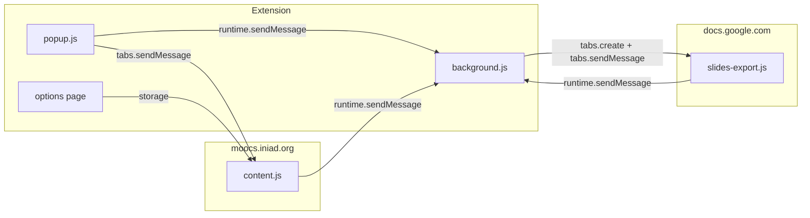

# エージェント向けアーキテクチャ

この文書は、Glass MOOCs 拡張の全体構造、主要ファイル、共通実装ルール、資料ダウンロード方針をまとめる。runtime message、download state、Slides 処理、デバッグ、CI、PR 粒度は専用文書を読む。

---

## アーキテクチャ概要

- **content.js**: MOOCs DOM の解析、資料候補の抽出、ページ内ダウンロード UI、`download-assets` ペイロードの組み立て。
- **background.js**: `storage.local` のダウンロード状態、キュー処理、`downloads.download`、Slides 用タブの生成・`waitForTabLoad`・ジョブ待ち受け。
- **slides-export.js**: `docs.google.com` 上で Slides SVG を収集・画像をインライン化して、background に渡す。失敗時のみ表示タブキャプチャへフォールバックする。
- **popup.js**: アクティブ MOOCs タブへ **`tabs.sendMessage`**（`get-page-context` / `start-course-collection` / `download-current-lecture` / `download-current-page`）。状態取得・リセットは **`runtime.sendMessage`** で background へ。Slides 権限は popup または専用許可ウィンドウから `permissions.request`。
- **options page**: `storage` を通じて content 側の設定へ反映する。設定のデフォルト値と merge は content 側と必ず整合させる。

---

## ファイルマップと主要関数

### [`public/manifest.json`](../../public/manifest.json)

- `permissions`: `storage`, `downloads`, `tabs`, `scripting`
- `host_permissions`: `https://moocs.iniad.org/*`
- `optional_host_permissions`: `<all_urls>`（Slides キャプチャ利用時に popup / 専用許可ウィンドウから付与）
- `content_scripts`: MOOCs + `https://docs.google.com/presentation/*`（後者のみ `slides-export.js`）

### [`public/content.js`](../../public/content.js)

| 領域                  | 代表関数                                                                                                                                                                                                             |
| --------------------- | -------------------------------------------------------------------------------------------------------------------------------------------------------------------------------------------------------------------- |
| 設定                  | `getDefaultSettings`, `mergeSettings`, `readSettings`                                                                                                                                                                |
| ページ装飾            | `enhancePage`, `scheduleEnhancements`, `decorateTabs`, `attachTextareaEnhancements`, `injectDownloadControls`                                                                                                        |
| URL / ページ文脈      | `parseMoocsUrl`, `getCurrentPageContext`, `extractCourseName`, `extractLectureName`                                                                                                                                  |
| 資料抽出              | `extractAssetCandidates`, `extractLectureEntries`, `extractPageEntries`, `isGoogleSlidesUrl`, `buildGoogleSlidesViewerUrl`, `deriveGoogleDriveDownloadUrl`                                                           |
| ダウンロード UI・状態 | `createDownloadPanel`, `injectDownloadControls`, `handleCourseCollectionRequest`, `handleLectureDownloadRequest`, `handleCurrentPageDownloadRequest`, `collectLectureAssetsFromCurrentPage`, `createCollectingState` |
| メッセージ            | `handleRuntimeMessage`                                                                                                                                                                                               |

補助ファイル:

- [`public/content/download-panel.js`](../../public/content/download-panel.js): ページ内ダウンロードパネルの UI コンポーネント

### [`public/background.js`](../../public/background.js)

| 領域             | 代表関数                                                                                                    |
| ---------------- | ----------------------------------------------------------------------------------------------------------- |
| ストレージラッパ | `storageGet`, `storageSet`, `loadState`, `saveState`                                                        |
| 状態復旧         | `recoverStaleState`, `recoverStateOnStartup`, `normalizeState`, `createIdleState`                           |
| キュー           | `queueDownloads`, `processDirectDownload`, `processSlidesDownload`                                          |
| Slides URL       | `buildSlidesViewerUrl`                                                                                      |
| Slides ジョブ    | `waitForTabLoad`, `sendTabMessageWithRetry`, `requestSlidesSessionInfo`, `requestSerializeCurrentSlideSvg`  |
| パス             | `buildDownloadFilename`, `buildLectureDirectory`, `sanitizePathSegment`, `normalizeEntry`, `summarizeEntry` |
| メッセージ       | `runtime.onMessage` リスナー（`MESSAGE_TYPES` 分岐）                                                        |

補助ファイル:

- [`public/background/pdf.js`](../../public/background/pdf.js): canvas / JPEG / PDF 組み立てユーティリティ

### [`public/slides-export.js`](../../public/slides-export.js)

- `waitForSlideReady`, `serializeCurrentSlideSvg`, `inlineSlideImages`, `getSlidesSessionInfo`
- グローバル二重起動防止: `globalThis.__glassmoocsExporterBooted`

補助ファイル:

- [`public/slides-export/svg-export.js`](../../public/slides-export/svg-export.js): SVG 直列化と画像インライン化

### [`public/popup.js`](../../public/popup.js) / [`public/popup.html`](../../public/popup.html)

- 進捗表示、科目単位 / 授業回単位 / ページ単位の収集トリガ、（あれば）Slides キャプチャ権限要求 UI

補助ファイル:

- [`public/popup/slides-permission-card.js`](../../public/popup/slides-permission-card.js): popup 内の Slides 権限カード制御

### [`public/slides-permission.js`](../../public/slides-permission.js) / [`public/slides-permission.html`](../../public/slides-permission.html)

- ページ内ダウンロード UI から開く **Slides キャプチャ権限専用ウィンドウ**

### [`src/options/`](../../src/options/)

- [`settings.js`](../../src/options/settings.js): `SETTINGS_STORAGE_KEY`, デフォルト設定、`mergeSettings` 等。content.js のデフォルトと **必ず整合**させる。

---

## 共通実装ルール

- **DOM 優先**: まずページ内の `a[href]` / `iframe[src]` 等から実 URL を得る。不要な権限・API を増やさない。
- **責務分離（content）**: 「対象検出」と「UI 注入」を分ける。
- **二重挿入防止**: 一度きりの UI には `data-glassmoocs-*` を付与。
- **遅延描画耐性**: `MutationObserver` + `enhancePage()` に乗せ、**再実行しても壊れない**こと。
- **設定を増やすとき**: [`public/content.js`](../../public/content.js) のデフォルトと [`src/options/settings.js`](../../src/options/settings.js) の **デフォルト値と merge の両方**を同じにする。
- **設定の最小化**: 本当に必要になるまで設定項目を増やさない。
- **ブラウザ API**: `const api = globalThis.browser || globalThis.chrome`。Promise / callback 両対応は既存ラッパに合わせる。
- **禁止**: 本番コードにローカルマシン固有の絶対パスを書かない。

---

## MOOCs 資料ダウンロード方針

- **第一候補**: ページ内に既にあるファイル URL をそのまま `downloads.download` 可能にする。
- **抽出元の例**: `a[href]`, `iframe[src]`, `embed[src]`, `object[data]`
- **UI**: 資料表示付近。ホーム画面ではダウンロード UI を出さない方針（既存実装に合わせる）。
- **候補が 1 件**: 単一ボタン。**複数**: 一覧または複数ボタン。
- **抽出ロジック**: **純関数に切り出し**、fixture / 保存 HTML があればそれで検証（リポジトリ外パスはコードに書かない）。

---

## 参考データ

- 元メモでは `downroad/moocs` を想定していたが、**リポジトリ内に無い場合がある**。実装前にパスを確認するか、匿名化した HTML を repo に置く運用を検討。

---

## 実装・検証の推奨順序

1. 資料ページの DOM パターンを特定する。
2. URL 抽出関数を作る（既存は `extractAssetCandidates`）。
3. `enhancePage()` から呼ぶ UI を差し込む。
4. 必要なら設定 ON/OFF（content + settings.js）。
5. **`corepack pnpm run ci`**（`eslint` + `prettier --check` + `pnpm run build:release`）。

---

## 既知の注意点

| 論点             | 内容                                                                                                          |
| ---------------- | ------------------------------------------------------------------------------------------------------------- |
| **候補の誤検出** | `extractAssetCandidates` が viewer HTML や動画を掴む可能性 — フィルタ強化は PDF / Slides 明示に寄せるとよい。 |

Slides 固有の注意は [`slides-flow.md`](slides-flow.md)、状態蓄積の注意は [`download-state.md`](download-state.md) を読む。
