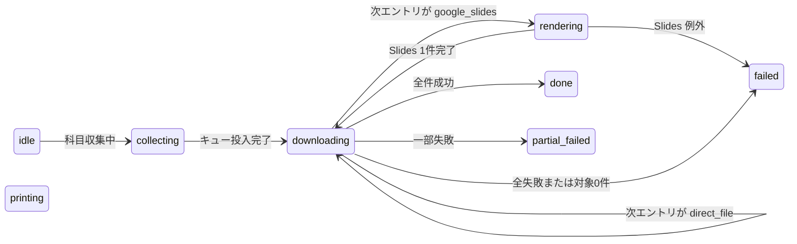

# Download State とストレージ

この文書は `storage.local` のキー、`DownloadState` / `DownloadEntry` / `SummarizedEntry`、状態遷移、復旧方針をまとめる。

---

## ストレージスキーマ

| キー                          | 定義場所              | 内容                                         |
| ----------------------------- | --------------------- | -------------------------------------------- |
| `glassmoocs_settings`         | content / settings.js | ユーザー設定オブジェクト                     |
| `glassmoocs_background_image` | content / settings.js | 背景画像 Data URL 等                         |
| `iniad_bg_image`              | レガシー              | 旧背景キー（移行用に読む場合あり）           |
| `glassmoocs_download_state`   | background / content  | **ダウンロード状態**（下記 `DownloadState`） |

**禁止**: 本番コードにローカルマシン固有の絶対パスを書かない。

---

## `DownloadState`（`normalizeState` 後の形）

`background.js` の `createIdleState` / `normalizeState` に準拠する。

| フィールド                 | 型                  | 説明                                                                                                    |
| -------------------------- | ------------------- | ------------------------------------------------------------------------------------------------------- |
| `status`                   | string              | `idle` / `collecting` / `downloading` / `rendering` / `printing` / `done` / `partial_failed` / `failed` |
| `courseName`               | string              | 科目名                                                                                                  |
| `startedAt` / `finishedAt` | string (ISO)        | ジョブの開始・終了時刻                                                                                  |
| `activeItem`               | string              | UI 用。例: `講義名 / ファイル名`                                                                        |
| `activeJobType`            | string              | エントリの `kind` と同じ値が入ることが多い                                                              |
| `sourceUrl` / `viewerUrl`  | string              | Slides 時の追跡用                                                                                       |
| `stage`                    | string              | 例: `open-slides-viewer`, `fetch-slides-pdf`, `svg-export-fallback`, `collect-slide-x/y` 等             |
| `pending`                  | `SummarizedEntry[]` | キュー残り（要約形）                                                                                    |
| `completed`                | array               | 成功エントリ + `downloadId`, `storedFilename` 等                                                        |
| `failed`                   | array               | 失敗エントリ + `error`、復旧時は中断メタのみの場合あり                                                  |
| `lastError`                | string              | 直近エラーメッセージ                                                                                    |
| `needsCapturePermission`   | boolean             | capture fallback が権限不足で止まったとき `true`。popup / ページ内 UI の導線表示に使う                  |

---

## `DownloadEntry`（キューに載る 1 資料）

`normalizeEntry` の出力に準拠。**`url` が空のエントリは `queueDownloads` で除外される。**

| フィールド     | 型     | 説明                                                               |
| -------------- | ------ | ------------------------------------------------------------------ |
| `id`           | string | 安定した一意 ID（`createAssetId`）                                 |
| `kind`         | string | **`direct_file`**（通常 URL）または **`google_slides`**            |
| `url`          | string | ダウンロードに使う URL。Slides では viewer 系                      |
| `sourceUrl`    | string | ページ上の元 `href` / `iframe.src` 等                              |
| `viewerUrl`    | string | Slides の埋め込み URL。background で `/pub` 等に変換される元になる |
| `filename`     | string | 拡張子付きファイル名（パスセグメントではない）                     |
| `year`         | string | 保存パス用。例 `2026`                                              |
| `lectureGroup` | string | 講義グループ名                                                     |
| `lectureName`  | string | 講義名                                                             |
| `pageTitle`    | string | ページタイトル由来のラベル                                         |
| `source`       | string | `anchor` / `iframe` / `embed` / `object` 等（抽出元）              |

`queueDownloads` 内では **Slides viewer URL / 通常 URL を正規化したキー**でデデュープ（先着優先）。

---

## `SummarizedEntry`

`summarizeEntry(entry)` の結果。`pending` やログ用。`id`, `kind`, `url`, `sourceUrl`, `viewerUrl`, `filename`, `year`, `lectureGroup`, `lectureName`, `pageTitle`, `source`。

---

## ダウンロード状態マシン（概念）

- **`queueDownloads`**: 開始時 `downloading`。各エントリ処理中は `google_slides` なら `rendering`、それ以外は `downloading`。ループ終了後、`failed.length` と `completed.length` で `done` / `partial_failed` / `failed` を決定。
- **`recoverStaleState`**: 拡張リロード時、`collecting` / `downloading` / `rendering` / `printing` を中断扱いに正規化。**過去の `failed` / `completed` は引き継がず**、`activeItem` があれば疑似 1 件を `failed` に入れるか、`idle` に戻す。

---

## 既知の注意点

| 論点           | 内容                                                                                                                           |
| -------------- | ------------------------------------------------------------------------------------------------------------------------------ |
| **状態の蓄積** | `recoverStaleState` で「リロード前の大量 failed」は引き継がない設計。それでも失敗が増える場合は **実行時の例外ループ**を疑う。 |
